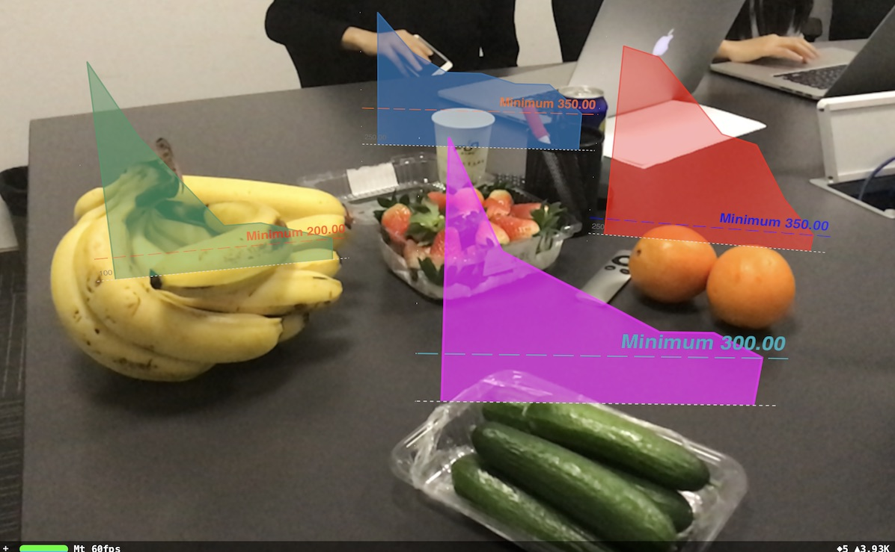
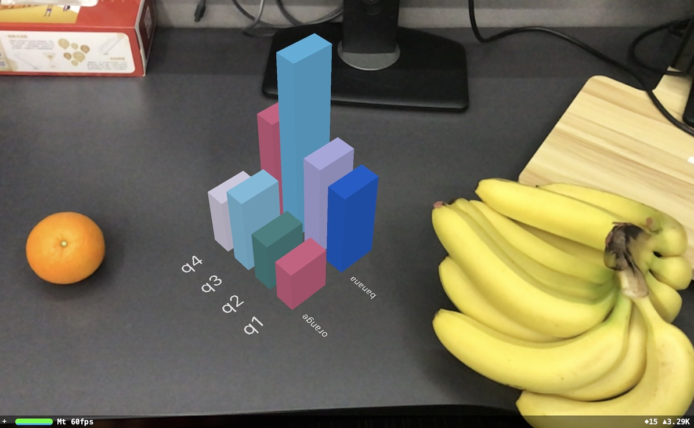

# ProjectDataToReality

A demo project using ARKit to project data into our real world. The project also involves CoreML and SceneKit.

## Screenshots of the Demo

## How to Run the Project

1. Put the mlmodel into project
    To smaller the size of the project, I delete the Inceptionv3.mlmodel file before pushing the project onto github. So to run the project, download the Inceptionv3.mlmodel from [here](https://developer.apple.com/machine-learning/), drag into the project and make sure xcode generate the related Inceptionv3 class correctly. If the swift class is not generated correctly, go to [CoreML Usage](http://hongchaozhang.github.io/blog/2017/12/28/coreml-usage/#model-usage) for a reference.
1. Build and run the project

## How to Use the Demo

### Project Chart to Reality

1. *single tap with one finger* to add chart above the recognized fruit.
    Make the fruit at the center of the screen, make sure the fruit is recognized (by looking at the debugging inf on the top left), and tap on empty space to add the related chart just above the fruit. Currently for demo usage, only four kinds of fruits are supported: banana, orange, cucumber and strawberry.
1. *single tap with two fingers* to add an ARChart at the center of the two fingers. For the ARChart, we can:
    1. rotate ARChart with two fingers.
    1. long press on a series label or a index label to highlight bars on the same rows or columns.
    1. long press on a bar to highlight a single bar with its value on top of it.
    1. single tap with one touch on the highlighted bar(s) to undo the highlight.
1. *double tap* to clean the AR scene.

### Face Detection

Set `doFaceDetection` to `true` to run face detection.

### Face Recognition

To do face recognition, train a face recognition model FaceRecognition.mlmodel, drag into the project, make sure the swift class is generated correctly (Refer to [mlmodel training](http://hongchaozhang.github.io/blog/2017/12/28/coreml-usage/#model-training) for help.), and un-comment the related code (by search key words "facerecognition").

## Notes on the Demo

As this is a rough demo, it need some enhancements:

1. Only four kinds of fruits are supported: banana, orange, cucumber and strawberry. But for anything recognized by Inceptionv3.mlmodel, we can add a sphere and the name just at the world position of the object. (Set `showRecognizedResultNearby` to `true`.)
1. The chart data of the four kinds of fruits are images exported from other apps.
1. For face detection on iphone, rotate the device to left by 90 degrees to make it work on landscape. This is an issue need to be fixed.
1. Face recognition needs a trained face recognition model, called FaceRecognition.mlmodel.
1. Face recognition request doesn't crop the image from camera according to the face detection result. This should be done to make face recognition more robust.

## Acknowledgement

1. [CoreML-in-ARKit](https://github.com/hanleyweng/CoreML-in-ARKit)
1. [ARCharts](https://github.com/Boris-Em/ARCharts)
